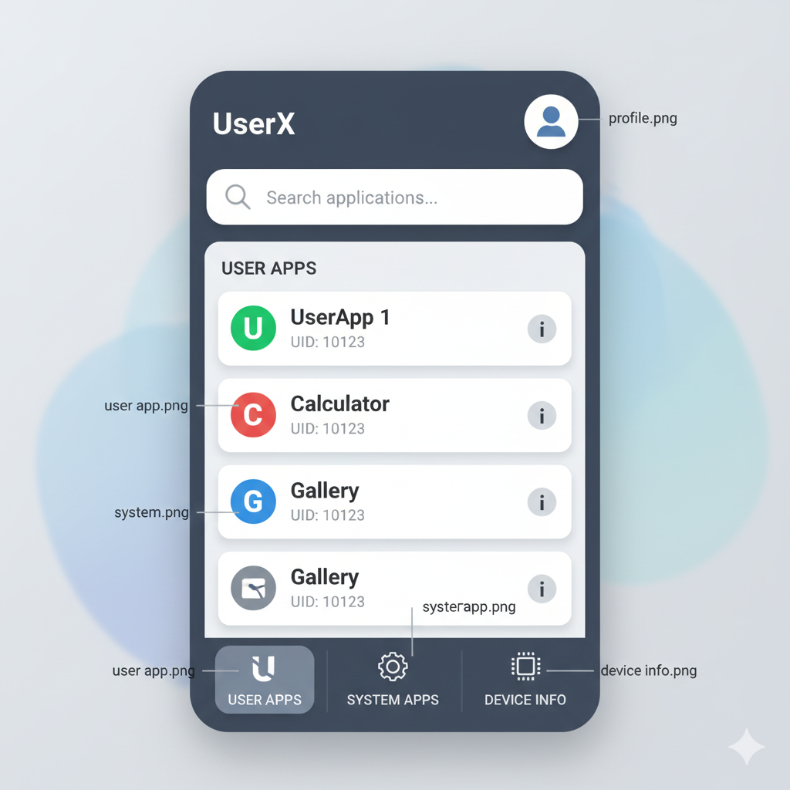

<h1 align="center">DeviceLens</h1>

<b>DeviceLens</b> Android utility tool to explore all <b>Apps</b>, <b>Apps-ID</b>, <b>Apps-INFO</b> and <b>Device Framework info</b>.

---

  

---

<h2 align="center">Project Config</h2>

| Property | Value |
|-----------|--------|
| **Language** | Java |
| **Libraries** | Native Android AppCompat |
| **Min SDK** | 21 |
| **Target SDK** | 34 |
| **IDE Used** | CodeAssist (Android IDE) |
| **File Size** | < 1 MB |
| **Offline Mode** | Supported |

---

<h2 align="center">DOWNLOAD.!</h2>

  

   
   
  

---

<h2 align="center">Features</h2>

- [ ] List all **user and system apps**  
- [ ] View **App ID**, package name, and version info  
- [ ] Redirect to **App Info page** instantly  
- [ ] Display **Device information** (Model, Brand, SDK, etc.)  
- [ ] **Lightweight (<100KB)** and battery efficient  
- [ ] Works **offline** and requires minimal permissions  
- [ ] Built using **Android Support v4/v7** (no AndroidX, no Material UI)

---

<h2 align="center"> Required Permissions</h2>

- `QUERY_ALL_PACKAGES` → To list all apps. 

---

<h3 align="center">🧑‍💻 Developed by   MD Sirajul Islam</h3>

Minimal • Fast • Native Android Utility Tool

